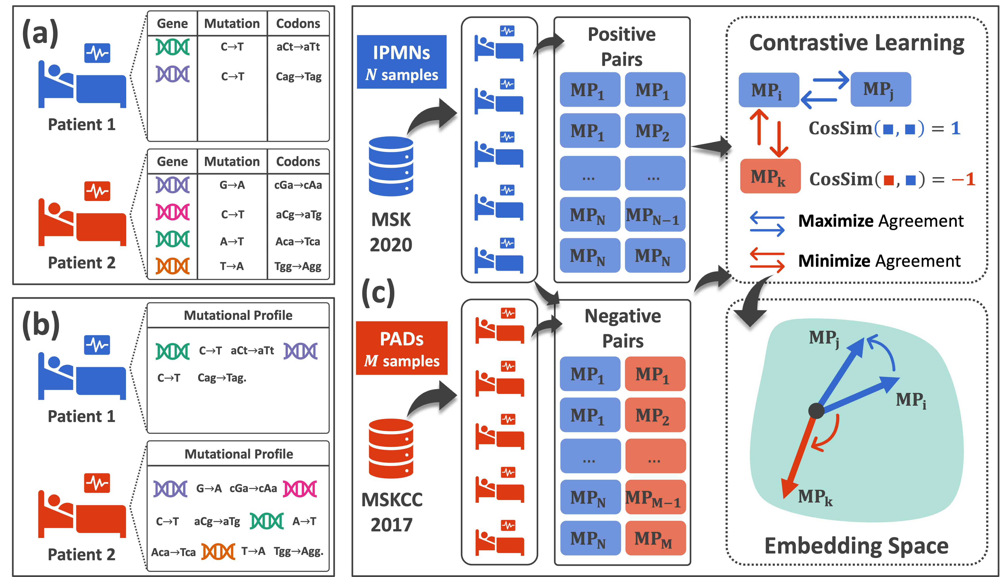
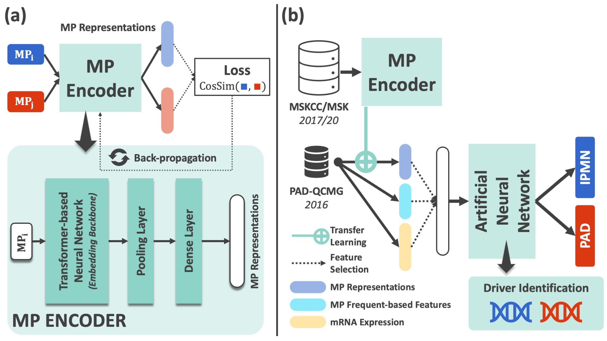

# Text-based Integration of Mutational Profiles for Classification and Biomarker Identification of Intraductal Papillary Mucinous Neoplasms of the Pancreas

## Manuscript

## Grapphical Abstract
### Contrastive Learning for Mutational Profile Signature Embeddings

### Application-centric DLDS system


## Requirements
```
torch == 1.11.0, torchlars == 0.1.2, torchvision == 0.12.0, sentence-transformers == 2.2.0

```
## Code usage
### Train Embedding
```
cd train_embeddings
python main.py
```
### Train DL classifiers
```
cd train_dl_timuta
python main.py
```
or
```
cd train_dl_ann
python main.py
```
### Biomarker Scoring
```
cd biomarker_scoring/timuta/
python main.py

```

## Results

## Experimental History

## License

## Citation
If you believe this AI system could help to cure cancer, please don't hesistate to give us a star :dizzy: and citation :pushpin::
